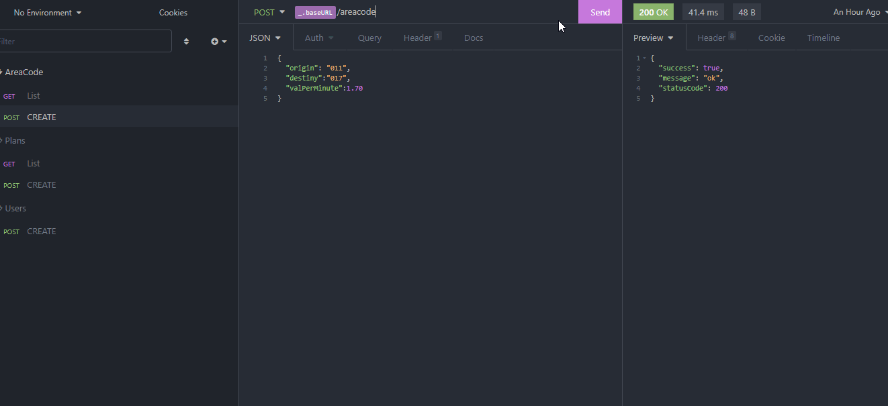
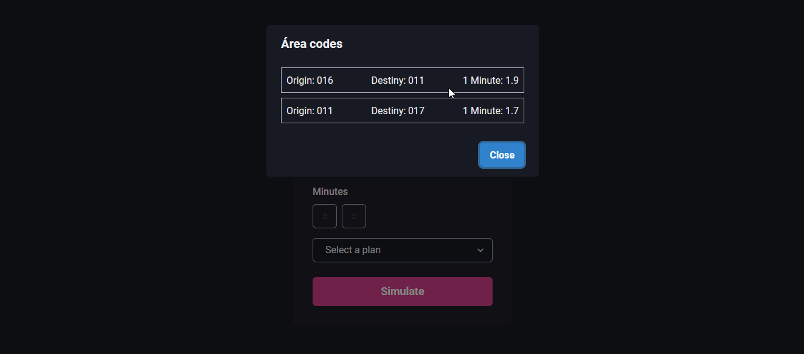

<h1 align="center">
  
</h1>

<p align="center">
</p>

<p align="center">
  <a href="#information_source-how-to-use-server">ℹ️ How To Use</a>&nbsp;&nbsp;&nbsp;|&nbsp;&nbsp;&nbsp;
  <a href="#rocket-technologies-server">🚀 Technologies</a>&nbsp;&nbsp;&nbsp;|&nbsp;&nbsp;&nbsp;
  <a href="#computer-author">💻 Author</a>&nbsp;&nbsp;&nbsp;

</p>

<p align="center">
 Telzir is a project developed in NodeJS and ReactJS with TypeScript, ChackraUI,  Docker, TDD and SOLID, as a challenge at enterprise LolDesign.
</p>

---

# Server
<h1 align="center">
  
</h1>

# :information_source: How To Use Server

Clone the repository

```bash
https://github.com/williamjayjay/challenge-telzir-loldesign
```

```bash
# Install the dependencies
yarn

# Start the Docker Containers(Postgress and Node)
docker-compose up

# Run migrations of typeorm
yarn typeorm migration:run

# Run the server
yarn dev
```

# :rocket: Technologies-server

- [NodeJS](https://nodejs.org/en/)
- [TypeScript](https://www.typescriptlang.org/)
- [Express](https://expressjs.com/)
- [Express-async-errors](https://github.com/davidbanham/express-async-errors#readme)
- [Typeorm](https://github.com/typeorm/typeorm#readme)
- [Uuid](https://github.com/uuidjs/uuid#readme)
- [Postgress-Node](https://node-postgres.com/)
- [Cors](https://github.com/expressjs/cors#readme)
- [Ts-node-dev](https://github.com/wclr/ts-node-dev#readme)
- [Reflect-meta-data](https://github.com/rbuckton/reflect-metadata)
- [Tsyringe](https://github.com/Microsoft/tsyringe#readme)


---

# Web app
<h1 align="center">

  
</h1>

# :information_source: How To Use Web App


```bash
# Install the dependencies
yarn

# Run the server
yarn dev
```

# :rocket: Technologies-web
- [ReactJS](https://pt-br.reactjs.org/)
- [NextJS](https://nextjs.org)
- [TypeScript](https://www.typescriptlang.org/)
- [Axios](https://github.com/axios/axios)
- [React-icons](https://github.com/react-icons/react-icons#readme)
- [Chakra-ui/core](https://chakra-ui.com/)
- [Chakra-ui/react](https://chakra-ui.com/)
- @emotion/react
- @emotion/styled
- framer-motion
- @types/react
- @types/node

<br />

---
# :computer: Author

<table>
  <tr>
    <td align="center">
      <a href="http://github.com/williamjayjay/">
        
        <br />
        <sub>
          <b>William Gomes</b>
        </sub>
       </a>
       </td>
     
    

  </tr>
</table>
<br />
